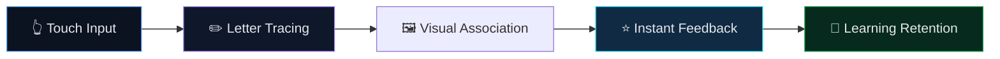
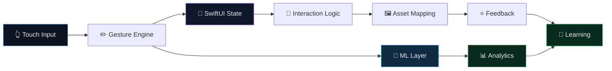
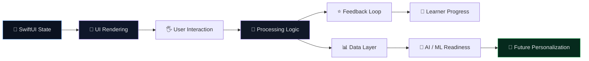
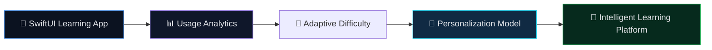

<!-- ===================================================== -->
<!--   Starmy — README.md (Premium Interactive)            -->
<!--   Classy • Visual • Interactive • Recruiter-Ready     -->
<!-- ===================================================== -->

<div align="center">

<!-- ✅ SAME BRAND BANNER STYLE -->
<p align="center">
  
</p>

<br/>


<br/><br/>

<a href="#-project-overview"><b>Overview</b></a> •
<a href="#-problem-space"><b>Problem</b></a> •
<a href="#-learning-experience-architecture"><b>Architecture</b></a> •
<a href="#-architecture-intelligence-model"><b>System Design</b></a> •
<a href="#-technical-highlights"><b>Tech</b></a> •
<a href="#-why-this-project-matters"><b>Impact</b></a> •
<a href="#-contact"><b>Contact</b></a>

</div>

---

## 🌟 Project Overview

**Starmy** is an interactive **iOS learning application** built with **SwiftUI** to make early education more engaging through:

- ✍️ Alphabet tracing  
- 🖼 Visual object association  
- 🎯 Touch-driven interaction  
- ⭐ Immediate feedback loops  

Rather than relying on passive content consumption, the project turns learning into a **hands-on interactive experience** where users actively engage with letters, shapes, and visual cues.

---

## 🧩 Problem Space

Traditional alphabet-learning apps often focus only on:

- Static visuals  
- Passive recognition  
- Limited user interaction  

That makes it harder for learners to develop:

- Muscle memory  
- Visual association  
- Engaged pattern recognition  

**Starmy** addresses this by combining:

- **Tracing-based learning**
- **Visual reinforcement**
- **Interactive response design**

This creates a stronger bridge between **seeing, touching, and remembering**.

---

## 🎓 Learning Experience Architecture

<details open>
<summary><b>📚 Interactive Learning Flow (click to collapse)</b></summary>
<br/>



</details>

---

## 🧠 Architecture Intelligence Model

<details open>
<summary><b>⚙️ System Design Thinking (click to collapse)</b></summary>
<br/>



</details>

---

## 🔬 Architecture Decisions Framework

<details open>
<summary><b>📊 Engineering Decision Flow (click to collapse)</b></summary>
<br/>



</details>

---

## 🎯 Key Architecture Decisions

<div align="center">

<table>
<tr>
<td width="33%" align="center" valign="top">

### 📱 SwiftUI Architecture
- Declarative UI  
- State-driven rendering  
- Clean component structure  


</td>

<td width="33%" align="center" valign="top">

### ✍️ Gesture-Based Input
- Touch interaction  
- Drawing-led learning  
- Higher engagement  


</td>

<td width="33%" align="center" valign="top">

### 🧠 AI-Ready Foundation
- Modular expansion  
- Analytics potential  
- Personalization path  


</td>
</tr>
</table>

</div>

---

## ✨ Core Feature Themes

<div align="center">

<table>
<tr>
<td width="33%" align="center" valign="top">

### ✍️ Tracing Experience
- Interactive tracing flow  
- Gesture-based engagement  
- Learning by doing  


</td>

<td width="33%" align="center" valign="top">

### 🖼 Visual Association
- Letter-to-object mapping  
- Asset-driven reinforcement  
- Better memory retention  


</td>

<td width="33%" align="center" valign="top">

### ⭐ Feedback Loop
- Immediate response  
- Positive reinforcement  
- Engagement-centered UX  


</td>
</tr>
</table>

</div>

---

## 🏗 Technical Highlights

- Built using **SwiftUI**
- Lightweight iOS app structure with a clear app entry point
- Visual asset integration through **Assets.xcassets**
- Interaction-led design suitable for educational workflows
- Foundation ready for:
  - Analytics tracking
  - Adaptive learning
  - AI-assisted personalization
  - Gesture interpretation extensions

---

## 📂 Project Structure

```bash
Starmy/
├── ContentView.swift        # Main interactive UI
├── starmyApp.swift          # App entry point
├── Assets.xcassets          # Images, icons, visual assets
├── Info.plist               # App configuration
```

---

## 🚀 Future Evolution Path

<details open>
<summary><b>🔮 From Learning App to Intelligent Learning Platform (click to collapse)</b></summary>
<br/>



</details>

---

## 🎯 Why This Project Matters

<div align="center">

<table>
<tr>
<td width="33%" align="center" valign="top">

### 🧠 Product Thinking
- Learner-centered UX  
- Engagement-first design  
- Educational value  


</td>

<td width="33%" align="center" valign="top">

### ⚙️ Engineering Thinking
- Modular structure  
- Interactive state handling  
- Scalable design direction  


</td>

<td width="33%" align="center" valign="top">

### 🚀 AI/Data Relevance
- Analytics-ready architecture  
- Future personalization potential  
- Behavioral learning insights  


</td>
</tr>
</table>

</div>

---

## 🤝 Contact

<div align="center">

<a href="https://www.linkedin.com/in/navyashree-byregowda-472821196/">
  
</a>

<a href="https://github.com/Navyagowda2714">
  
</a>

<a href="mailto:navyashreebyregowda@gmail.com">
  
</a>

<br/><br/>
<sub>Starmy — interactive learning powered by thoughtful design, engaging UX, and future AI potential.</sub>

</div>
